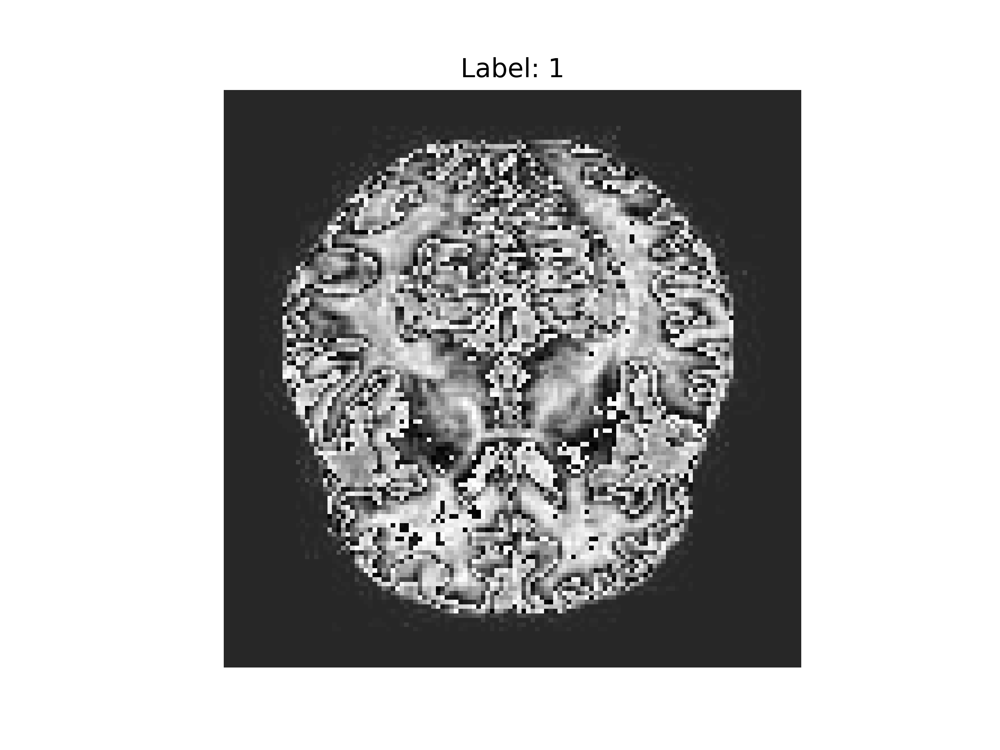

# Brain Scan Image Classification for Dementia Patients🧠

  

This is a repository for educational purposes. 
It provides a good and clear way to understand the workflow of a simple vision multiclass classification problem.

## What will I learn?👨🏽‍💻
- How to work with torchvision
- How to create a .csv file that maps to the images
- How to convert images to tensors and tensors to images
- How to build a CNN model for multiclass clasification
- How to make a compartimentalize training loop

